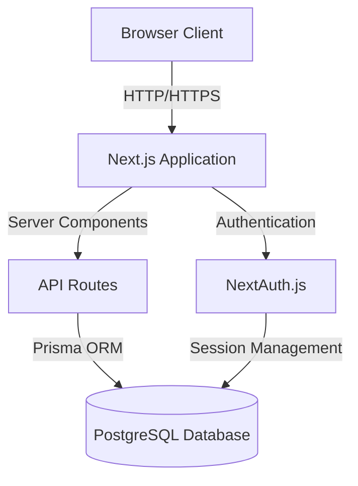

# Finance Tracker - Design Document

## Overview

The Finance Tracker is a comprehensive full-stack web application built with Next.js that enables users to manage personal finances and investment portfolios. It combines budget planning, transaction tracking, multi-currency portfolio management, goal tracking, AI-powered insights, automated data synchronization, and forecasting capabilities. The application follows a modern architecture with server-side rendering, API routes, automated workflows, and a component-based UI structure.

### Technology Stack

- **Frontend Framework**: Next.js 14+ (App Router)
- **UI Library**: React 18+
- **Styling**: Tailwind CSS
- **Charts**: Recharts or Chart.js
- **Database**: PostgreSQL with Prisma ORM
- **Authentication**: NextAuth.js
- **Excel Export**: ExcelJS
- **State Management**: Zustand (for complex state management)
- **Form Handling**: React Hook Form with Zod validation
- **Date Handling**: date-fns
- **Automation**: n8n (for scheduled tasks and workflows)
- **AI Integration**: OpenAI API or Google Gemini API
- **Market Data APIs**: Yahoo Finance API, ExchangeRate-API
- **Notifications**: Email (Resend/SendGrid) and in-app notifications

## Architecture

### High-Level Architecture



### Application Structure

```
finance-tracker/
├── app/
│   ├── (auth)/
│   │   ├── login/
│   │   └── register/
│   ├── (dashboard)/
│   │   ├── layout.tsx
│   │   ├── page.tsx (Overview Dashboard)
│   │   ├── portfolio/
│   │   │   ├── page.tsx
│   │   │   └── [assetId]/
│   │   ├── budgets/
│   │   ├── transactions/
│   │   ├── goals/
│   │   ├── statistics/
│   │   ├── forecast/
│   │   ├── journal/
│   │   └── settings/
│   ├── api/
│   │   ├── auth/
│   │   ├── budgets/
│   │   ├── transactions/
│   │   ├── portfolio/
│   │   │   ├── assets/
│   │   │   ├── sync/
│   │   │   └── prices/
│   │   ├── goals/
│   │   ├── currencies/
│   │   ├── statistics/
│   │   ├── forecast/
│   │   ├── insights/
│   │   ├── alerts/
│   │   ├── journal/
│   │   └── export/
│   └── layout.tsx
├── components/
│   ├── ui/ (reusable UI components)
│   ├── charts/
│   ├── forms/
│   ├── portfolio/
│   ├── goals/
│   └── layout/
├── lib/
│   ├── prisma.ts
│   ├── auth.ts
│   ├── validations/
│   ├── ai/
│   │   └── insights.ts
│   ├── market-data/
│   │   ├── yahoo-finance.ts
│   │   ├── exchange-rates.ts
│   │   └── crypto.ts
│   └── utils/
│       ├── calculations.ts
│       ├── currency.ts
│       └── forecasting.ts
├── prisma/
│   └── schema.prisma
├── n8n-workflows/
│   ├── daily-price-sync.json
│   ├── exchange-rate-sync.json
│   └── alert-notifications.json
└── types/
    └── index.ts
```

## Components and Interfaces

### Core Components

#### 1. Authentication Components

**LoginForm**
- Handles user login with email/password
- Integrates with NextAuth.js
- Displays validation errors
- Redirects to dashboard on success

**RegisterForm**
- User registration with email, password, name
- Password strength validation
- Email uniqueness check
- Auto-login after registration

#### 2. Budget Management Components

**BudgetCreator**
- Form for creating new budgets
- Salary input field
- Dynamic category addition
- Percentage/amount allocation toggle
- Real-time validation of total allocation

**BudgetCategoryCard**
- Displays individual budget category
- Shows allocated vs spent amounts
- Progress bar visualization
- Edit/delete actions

**BudgetOverview**
- Grid of all budget categories
- Total income vs total allocated
- Remaining balance indicator
- Quick add category button

#### 3. Transaction Components

**TransactionForm**
- Add/edit transaction modal
- Date picker
- Amount input
- Category dropdown
- Description field
- Income/expense toggle

**TransactionList**
- Paginated table of transactions
- Sortable columns (date, amount, category)
- Filter by date range, category, type
- Inline edit/delete actions
- Search functionality

**TransactionSummary**
- Total income/expenses for period
- Net balance
- Category breakdown

#### 4. Statistics & Visualization Components

**StatisticsDashboard**
- Overview cards (total income, expenses, balance, savings rate)
- Time period selector
- Multiple chart views

**BudgetVsActualChart**
- Bar chart comparing budgeted vs actual spending
- Color-coded for over/under budget
- Interactive tooltips

**CategoryDistributionChart**
- Pie/donut chart of spending by category
- Percentage labels
- Click to filter transactions

**SpendingTrendChart**
- Line chart showing spending over time
- Multiple series (income, expenses, net)
- Zoom and pan capabilities

#### 5. Forecasting Components

**ForecastGenerator**
- Time period selector (1, 3, 6, 12 months)
- Parameter adjustments (expected income changes, planned expenses)
- Generate forecast button

**ForecastChart**
- Line chart with historical and projected data
- Visual distinction between actual and forecast
- Confidence intervals

**ForecastSummary**
- Projected end balance
- Average monthly income/expenses
- Savings projection
- Warning indicators for negative trends

#### 6. Export Components

**ExportDialog**
- Data type selection (transactions, budgets, statistics, forecast)
- Date range picker
- Format options
- Export button with loading state

#### 7. Portfolio Management Components

**PortfolioDashboard**
- Summary cards (net worth, invested capital, unrealized P/L, % growth)
- Asset class breakdown chart
- Currency exposure chart
- Platform distribution
- Historical performance graph

**AssetCard**
- Asset name and ticker
- Platform badge
- Current price and units
- Buy price and date
- Gain/loss with percentage
- Quick actions (edit, sell, view details)

**AddAssetForm**
- Platform selector
- Asset type (stock, crypto, gold, cash)
- Ticker/name input with autocomplete
- Buy price and units
- Purchase date
- Exchange rate (auto-filled or manual)
- Notes field

**AssetDetailView**
- Complete transaction history for asset
- Performance chart
- Cost basis and current value
- Dividend history (if applicable)
- Related journal entries

**CSVImportDialog**
- File upload
- Column mapping interface
- Preview imported data
- Validation errors display
- Import confirmation

#### 8. Multi-Currency Components

**CurrencyToggle**
- Switch between MYR/SGD/USD base currency
- Display current exchange rates
- Last update timestamp

**ExchangeRateWidget**
- Current rates for all currency pairs
- Historical rate chart
- Rate alerts configuration
- Manual rate override option

**CurrencyConverter**
- Quick conversion tool
- Amount input
- From/to currency selectors
- Real-time conversion display

#### 9. Goal Tracking Components

**GoalCard**
- Goal name and icon
- Progress bar with percentage
- Current vs target amount
- Projected completion date
- Quick add contribution button

**GoalCreator**
- Goal name and category
- Target amount
- Timeframe/target date
- Initial contribution
- Monthly contribution plan
- Expected return rate

**GoalDetailView**
- Contribution history
- Linked assets/savings
- Progress chart over time
- Milestone markers
- Adjustment recommendations

#### 10. AI Insights Components

**InsightsDashboard**
- AI-generated summary cards
- Financial health score
- Rebalancing recommendations
- Spending pattern analysis
- Risk assessment

**FinancialHealthScore**
- Overall score visualization (0-100)
- Component scores (liquidity, diversification, savings rate)
- Trend indicator
- Improvement suggestions

**RebalancingRecommendations**
- Current vs target allocation
- Suggested trades
- Expected impact
- One-click apply option

#### 11. Alert & Notification Components

**AlertCenter**
- List of active alerts
- Alert history
- Configure new alerts
- Alert type filters

**AlertConfigDialog**
- Alert type selector (price, exchange rate, milestone, allocation drift)
- Threshold settings
- Notification channel selection
- Frequency settings

**NotificationBell**
- Unread count badge
- Dropdown with recent notifications
- Mark as read functionality
- Navigate to related item

#### 12. Investment Journal Components

**JournalEntry**
- Date and time
- Associated trade/asset
- Decision rationale
- Emotional tags
- Outcome (if closed)

**JournalEditor**
- Rich text editor
- Emotional tag selector
- Asset/trade linking
- Image upload support

**JournalAnalytics**
- Emotion vs performance correlation
- Decision pattern analysis
- Success rate by emotion
- Learning insights

### API Endpoints

#### Authentication
- `POST /api/auth/register` - User registration
- `POST /api/auth/login` - User login (handled by NextAuth)
- `POST /api/auth/logout` - User logout

#### Budgets
- `GET /api/budgets` - Get all budgets for user
- `POST /api/budgets` - Create new budget
- `PUT /api/budgets/[id]` - Update budget
- `DELETE /api/budgets/[id]` - Delete budget
- `GET /api/budgets/[id]/categories` - Get budget categories

#### Transactions
- `GET /api/transactions` - Get transactions (with filters)
- `POST /api/transactions` - Create transaction
- `PUT /api/transactions/[id]` - Update transaction
- `DELETE /api/transactions/[id]` - Delete transaction
- `GET /api/transactions/summary` - Get transaction summary

#### Statistics
- `GET /api/statistics/overview` - Get overview statistics
- `GET /api/statistics/by-category` - Category breakdown
- `GET /api/statistics/trends` - Spending trends over time
- `GET /api/statistics/budget-comparison` - Budget vs actual

#### Forecast
- `POST /api/forecast/generate` - Generate forecast based on parameters
- `GET /api/forecast/[id]` - Get saved forecast

#### Export
- `POST /api/export/excel` - Generate and download Excel file

#### Portfolio
- `GET /api/portfolio/assets` - Get all assets for user
- `POST /api/portfolio/assets` - Add new asset
- `PUT /api/portfolio/assets/[id]` - Update asset
- `DELETE /api/portfolio/assets/[id]` - Delete asset
- `GET /api/portfolio/summary` - Get portfolio summary
- `POST /api/portfolio/import` - Import assets from CSV
- `GET /api/portfolio/performance` - Get historical performance data

#### Prices
- `GET /api/prices/[ticker]` - Get current price for ticker
- `POST /api/prices/sync` - Manually trigger price sync
- `GET /api/prices/history/[ticker]` - Get historical prices

#### Currencies
- `GET /api/currencies/rates` - Get current exchange rates
- `GET /api/currencies/history` - Get historical rates
- `POST /api/currencies/alerts` - Create exchange rate alert
- `GET /api/currencies/convert` - Convert amount between currencies

#### Goals
- `GET /api/goals` - Get all goals for user
- `POST /api/goals` - Create new goal
- `PUT /api/goals/[id]` - Update goal
- `DELETE /api/goals/[id]` - Delete goal
- `POST /api/goals/[id]/contributions` - Add contribution to goal
- `GET /api/goals/[id]/projection` - Get goal completion projection

#### Insights
- `GET /api/insights/summary` - Get AI-generated insights
- `GET /api/insights/health-score` - Get financial health score
- `GET /api/insights/rebalancing` - Get rebalancing recommendations
- `POST /api/insights/forecast` - Generate AI-powered forecast

#### Alerts
- `GET /api/alerts` - Get all alerts for user
- `POST /api/alerts` - Create new alert
- `PUT /api/alerts/[id]` - Update alert
- `DELETE /api/alerts/[id]` - Delete alert
- `POST /api/alerts/[id]/dismiss` - Dismiss alert

#### Journal
- `GET /api/journal/entries` - Get journal entries
- `POST /api/journal/entries` - Create journal entry
- `PUT /api/journal/entries/[id]` - Update entry
- `DELETE /api/journal/entries/[id]` - Delete entry
- `GET /api/journal/analytics` - Get journal analytics

## Data Models

### Database Schema (Prisma)

```prisma
model User {
  id            String        @id @default(cuid())
  email         String        @unique
  name          String?
  password      String
  createdAt     DateTime      @default(now())
  updatedAt     DateTime      @updatedAt
  budgets       Budget[]
  transactions  Transaction[]
  forecasts     Forecast[]
}

model Budget {
  id          String           @id @default(cuid())
  userId      String
  user        User             @relation(fields: [userId], references: [id], onDelete: Cascade)
  name        String
  totalAmount Decimal          @db.Decimal(10, 2)
  period      String           // monthly, yearly
  startDate   DateTime
  endDate     DateTime?
  categories  BudgetCategory[]
  createdAt   DateTime         @default(now())
  updatedAt   DateTime         @updatedAt
  
  @@index([userId])
}

model BudgetCategory {
  id              String        @id @default(cuid())
  budgetId        String
  budget          Budget        @relation(fields: [budgetId], references: [id], onDelete: Cascade)
  name            String
  allocatedAmount Decimal       @db.Decimal(10, 2)
  color           String?       // for chart visualization
  transactions    Transaction[]
  createdAt       DateTime      @default(now())
  updatedAt       DateTime      @updatedAt
  
  @@index([budgetId])
}

model Transaction {
  id          String          @id @default(cuid())
  userId      String
  user        User            @relation(fields: [userId], references: [id], onDelete: Cascade)
  categoryId  String?
  category    BudgetCategory? @relation(fields: [categoryId], references: [id], onDelete: SetNull)
  amount      Decimal         @db.Decimal(10, 2)
  type        String          // income, expense
  description String
  date        DateTime
  createdAt   DateTime        @default(now())
  updatedAt   DateTime        @updatedAt
  
  @@index([userId])
  @@index([categoryId])
  @@index([date])
}

model Forecast {
  id              String   @id @default(cuid())
  userId          String
  user            User     @relation(fields: [userId], references: [id], onDelete: Cascade)
  name            String
  startDate       DateTime
  endDate         DateTime
  projectedData   Json     // stores forecast calculations
  parameters      Json     // stores input parameters
  createdAt       DateTime @default(now())
  
  @@index([userId])
}

model Asset {
  id              String        @id @default(cuid())
  userId          String
  user            User          @relation(fields: [userId], references: [id], onDelete: Cascade)
  platform        String        // StashAway, moomoo, Versa, etc.
  assetType       String        // stock, crypto, gold, cash, etc.
  ticker          String?       // stock ticker or crypto symbol
  name            String
  units           Decimal       @db.Decimal(18, 8)
  buyPrice        Decimal       @db.Decimal(18, 8)
  currentPrice    Decimal?      @db.Decimal(18, 8)
  currency        String        // MYR, SGD, USD
  purchaseDate    DateTime
  notes           String?
  goalId          String?       // linked goal
  goal            Goal?         @relation(fields: [goalId], references: [id], onDelete: SetNull)
  journalEntries  JournalEntry[]
  priceHistory    PriceHistory[]
  createdAt       DateTime      @default(now())
  updatedAt       DateTime      @updatedAt
  
  @@index([userId])
  @@index([ticker])
  @@index([goalId])
}

model PriceHistory {
  id        String   @id @default(cuid())
  assetId   String
  asset     Asset    @relation(fields: [assetId], references: [id], onDelete: Cascade)
  price     Decimal  @db.Decimal(18, 8)
  date      DateTime
  createdAt DateTime @default(now())
  
  @@index([assetId, date])
}

model ExchangeRate {
  id           String   @id @default(cuid())
  fromCurrency String
  toCurrency   String
  rate         Decimal  @db.Decimal(18, 8)
  date         DateTime
  createdAt    DateTime @default(now())
  
  @@unique([fromCurrency, toCurrency, date])
  @@index([date])
}

model Goal {
  id                String   @id @default(cuid())
  userId            String
  user              User     @relation(fields: [userId], references: [id], onDelete: Cascade)
  name              String
  category          String   // property, wedding, car, education, etc.
  targetAmount      Decimal  @db.Decimal(18, 2)
  currentAmount     Decimal  @db.Decimal(18, 2) @default(0)
  currency          String   @default("MYR")
  targetDate        DateTime?
  monthlyContribution Decimal? @db.Decimal(18, 2)
  expectedReturn    Decimal? @db.Decimal(5, 2) // annual return percentage
  assets            Asset[]
  contributions     GoalContribution[]
  createdAt         DateTime @default(now())
  updatedAt         DateTime @updatedAt
  
  @@index([userId])
}

model GoalContribution {
  id        String   @id @default(cuid())
  goalId    String
  goal      Goal     @relation(fields: [goalId], references: [id], onDelete: Cascade)
  amount    Decimal  @db.Decimal(18, 2)
  date      DateTime
  notes     String?
  createdAt DateTime @default(now())
  
  @@index([goalId])
}

model Alert {
  id          String   @id @default(cuid())
  userId      String
  user        User     @relation(fields: [userId], references: [id], onDelete: Cascade)
  type        String   // price, exchange_rate, milestone, allocation_drift, bill_reminder
  condition   Json     // stores alert conditions
  isActive    Boolean  @default(true)
  lastTriggered DateTime?
  createdAt   DateTime @default(now())
  updatedAt   DateTime @updatedAt
  
  @@index([userId, isActive])
}

model Notification {
  id        String   @id @default(cuid())
  userId    String
  user      User     @relation(fields: [userId], references: [id], onDelete: Cascade)
  type      String
  title     String
  message   String
  isRead    Boolean  @default(false)
  relatedId String?  // ID of related entity (asset, goal, etc.)
  createdAt DateTime @default(now())
  
  @@index([userId, isRead])
}

model JournalEntry {
  id          String   @id @default(cuid())
  userId      String
  user        User     @relation(fields: [userId], references: [id], onDelete: Cascade)
  assetId     String?
  asset       Asset?   @relation(fields: [assetId], references: [id], onDelete: SetNull)
  title       String
  content     String   @db.Text
  emotionTags String[] // confident, uncertain, FOMO, fearful, etc.
  tradeType   String?  // buy, sell, hold
  outcome     String?  // success, failure, neutral (filled after position closed)
  date        DateTime
  createdAt   DateTime @default(now())
  updatedAt   DateTime @updatedAt
  
  @@index([userId])
  @@index([assetId])
}

model PortfolioSnapshot {
  id              String   @id @default(cuid())
  userId          String
  user            User     @relation(fields: [userId], references: [id], onDelete: Cascade)
  totalValue      Decimal  @db.Decimal(18, 2)
  totalInvested   Decimal  @db.Decimal(18, 2)
  unrealizedGain  Decimal  @db.Decimal(18, 2)
  currency        String
  breakdown       Json     // asset class, platform, currency breakdown
  date            DateTime
  createdAt       DateTime @default(now())
  
  @@index([userId, date])
}
```

### TypeScript Interfaces

```typescript
interface Budget {
  id: string;
  userId: string;
  name: string;
  totalAmount: number;
  period: 'monthly' | 'yearly';
  startDate: Date;
  endDate?: Date;
  categories: BudgetCategory[];
}

interface BudgetCategory {
  id: string;
  budgetId: string;
  name: string;
  allocatedAmount: number;
  spentAmount?: number; // calculated
  color?: string;
}

interface Transaction {
  id: string;
  userId: string;
  categoryId?: string;
  category?: BudgetCategory;
  amount: number;
  type: 'income' | 'expense';
  description: string;
  date: Date;
}

interface Asset {
  id: string;
  userId: string;
  platform: string;
  assetType: 'stock' | 'crypto' | 'gold' | 'cash' | 'other';
  ticker?: string;
  name: string;
  units: number;
  buyPrice: number;
  currentPrice?: number;
  currency: 'MYR' | 'SGD' | 'USD';
  purchaseDate: Date;
  notes?: string;
  goalId?: string;
  unrealizedGain?: number; // calculated
  unrealizedGainPercent?: number; // calculated
}

interface PortfolioSummary {
  totalNetWorth: number;
  totalInvested: number;
  unrealizedGain: number;
  unrealizedGainPercent: number;
  currency: string;
  assetClassBreakdown: AssetClassBreakdown[];
  currencyExposure: CurrencyExposure[];
  platformDistribution: PlatformDistribution[];
}

interface AssetClassBreakdown {
  assetType: string;
  value: number;
  percentage: number;
  count: number;
}

interface CurrencyExposure {
  currency: string;
  value: number;
  percentage: number;
}

interface PlatformDistribution {
  platform: string;
  value: number;
  percentage: number;
  assetCount: number;
}

interface ExchangeRate {
  fromCurrency: string;
  toCurrency: string;
  rate: number;
  date: Date;
}

interface Goal {
  id: string;
  userId: string;
  name: string;
  category: string;
  targetAmount: number;
  currentAmount: number;
  currency: string;
  targetDate?: Date;
  monthlyContribution?: number;
  expectedReturn?: number;
  progressPercent: number; // calculated
  projectedCompletionDate?: Date; // calculated
  remainingAmount: number; // calculated
}

interface GoalContribution {
  id: string;
  goalId: string;
  amount: number;
  date: Date;
  notes?: string;
}

interface Alert {
  id: string;
  userId: string;
  type: 'price' | 'exchange_rate' | 'milestone' | 'allocation_drift' | 'bill_reminder';
  condition: AlertCondition;
  isActive: boolean;
  lastTriggered?: Date;
}

interface AlertCondition {
  ticker?: string;
  currencyPair?: string;
  threshold?: number;
  direction?: 'above' | 'below';
  goalId?: string;
  driftPercent?: number;
}

interface Notification {
  id: string;
  userId: string;
  type: string;
  title: string;
  message: string;
  isRead: boolean;
  relatedId?: string;
  createdAt: Date;
}

interface JournalEntry {
  id: string;
  userId: string;
  assetId?: string;
  asset?: Asset;
  title: string;
  content: string;
  emotionTags: string[];
  tradeType?: 'buy' | 'sell' | 'hold';
  outcome?: 'success' | 'failure' | 'neutral';
  date: Date;
}

interface JournalAnalytics {
  totalEntries: number;
  emotionDistribution: { emotion: string; count: number }[];
  successRateByEmotion: { emotion: string; successRate: number }[];
  averageReturnByEmotion: { emotion: string; avgReturn: number }[];
}

interface AIInsight {
  type: 'summary' | 'rebalancing' | 'risk' | 'opportunity';
  title: string;
  message: string;
  priority: 'high' | 'medium' | 'low';
  actionable: boolean;
  relatedData?: any;
}

interface FinancialHealthScore {
  overall: number; // 0-100
  components: {
    liquidityRatio: number;
    diversificationScore: number;
    savingsRate: number;
    debtToIncomeRatio: number;
  };
  trend: 'improving' | 'stable' | 'declining';
  recommendations: string[];
}

interface StatisticsData {
  totalIncome: number;
  totalExpenses: number;
  netBalance: number;
  savingsRate: number;
  categoryBreakdown: CategoryStat[];
  trends: TrendData[];
}

interface CategoryStat {
  categoryId: string;
  categoryName: string;
  amount: number;
  percentage: number;
  budgeted?: number;
}

interface TrendData {
  date: string;
  income: number;
  expenses: number;
  net: number;
}

interface ForecastData {
  id: string;
  name: string;
  startDate: Date;
  endDate: Date;
  projections: ForecastProjection[];
  parameters: ForecastParameters;
}

interface ForecastProjection {
  date: string;
  projectedIncome: number;
  projectedExpenses: number;
  projectedBalance: number;
  projectedPortfolioValue?: number;
}

interface ForecastParameters {
  periodMonths: number;
  expectedIncomeChange?: number;
  plannedExpenses?: PlannedExpense[];
  expectedReturn?: number;
}

interface PlannedExpense {
  name: string;
  amount: number;
  date: Date;
}
```

## Error Handling

### Client-Side Error Handling

1. **Form Validation Errors**
   - Display inline validation messages
   - Highlight invalid fields
   - Prevent submission until valid

2. **API Request Errors**
   - Show toast notifications for errors
   - Provide retry mechanisms
   - Log errors to console in development

3. **Authentication Errors**
   - Redirect to login on 401
   - Display clear error messages
   - Handle session expiration gracefully

### Server-Side Error Handling

1. **API Route Error Responses**
   ```typescript
   {
     error: string;
     message: string;
     statusCode: number;
   }
   ```

2. **Database Errors**
   - Catch Prisma errors
   - Return user-friendly messages
   - Log detailed errors server-side

3. **Validation Errors**
   - Use Zod schemas for validation
   - Return structured validation errors
   - Include field-specific messages

### Error Logging

- Use structured logging (e.g., Winston, Pino)
- Log errors with context (user ID, request ID)
- Different log levels (error, warn, info, debug)
- Consider error tracking service (Sentry) for production

## Testing Strategy

### Unit Testing

**Tools**: Jest, React Testing Library

**Coverage Areas**:
- Utility functions (calculations, formatting, validation)
- Data transformation functions
- Forecast algorithm logic
- Form validation schemas

**Example Tests**:
- Budget allocation validation
- Transaction categorization
- Forecast calculation accuracy
- Date range filtering

### Integration Testing

**Tools**: Jest, MSW (Mock Service Worker)

**Coverage Areas**:
- API route handlers
- Database operations with Prisma
- Authentication flows
- Data fetching and mutations

**Example Tests**:
- Create budget with categories
- Add transaction and update budget balance
- Generate forecast from historical data
- Export data to Excel format

### End-to-End Testing

**Tools**: Playwright or Cypress

**Coverage Areas**:
- Complete user workflows
- Multi-page interactions
- Authentication flows
- Data persistence

**Example Tests**:
- User registration and login
- Create budget, add transactions, view statistics
- Generate and export forecast
- Responsive design on different viewports

### Component Testing

**Tools**: React Testing Library, Storybook

**Coverage Areas**:
- Individual React components
- Component interactions
- Accessibility compliance
- Visual regression

**Example Tests**:
- Budget form submission
- Chart rendering with data
- Transaction list filtering
- Modal open/close behavior

## Security Considerations

1. **Authentication & Authorization**
   - Secure password hashing (bcrypt)
   - JWT tokens with appropriate expiration
   - CSRF protection
   - Rate limiting on auth endpoints

2. **Data Protection**
   - User data isolation (row-level security)
   - Input sanitization
   - SQL injection prevention (Prisma)
   - XSS protection

3. **API Security**
   - Authentication middleware on protected routes
   - Request validation
   - CORS configuration
   - HTTPS enforcement in production

4. **Environment Variables**
   - Secure storage of secrets
   - Different configs for dev/prod
   - No sensitive data in client-side code

## Performance Optimization

1. **Next.js Optimizations**
   - Server-side rendering for initial load
   - Static generation where possible
   - Image optimization with next/image
   - Code splitting and lazy loading

2. **Database Optimization**
   - Proper indexing on frequently queried fields
   - Query optimization with Prisma
   - Connection pooling
   - Pagination for large datasets

3. **Caching Strategy**
   - Cache static data (budget categories)
   - SWR for data fetching
   - Memoization of expensive calculations
   - CDN for static assets

4. **Client-Side Performance**
   - Debounce search and filter inputs
   - Virtual scrolling for long lists
   - Optimize chart rendering
   - Minimize re-renders with React.memo

## Automation & Integration Architecture

### n8n Workflow Design

**Daily Price Sync Workflow**
1. Trigger: Cron schedule (daily at market close)
2. Fetch all unique tickers from database
3. Call Yahoo Finance API for each ticker
4. Update asset current prices
5. Create price history records
6. Send notification if sync fails

**Exchange Rate Sync Workflow**
1. Trigger: Cron schedule (daily)
2. Call ExchangeRate-API for MYR/SGD, MYR/USD, SGD/USD
3. Store rates in database
4. Check for alert conditions
5. Trigger alerts if thresholds crossed

**Portfolio Snapshot Workflow**
1. Trigger: Cron schedule (daily)
2. Calculate total portfolio value for each user
3. Create portfolio snapshot record
4. Calculate performance metrics
5. Store in database for historical tracking

**Alert Monitoring Workflow**
1. Trigger: Cron schedule (every hour)
2. Fetch active alerts
3. Check conditions against current data
4. Send notifications for triggered alerts
5. Update lastTriggered timestamp

**AI Insights Generation Workflow**
1. Trigger: Weekly or on-demand
2. Fetch user portfolio and transaction data
3. Call AI API with structured prompt
4. Parse and store insights
5. Create notification for user

### External API Integration

**Yahoo Finance API**
- Endpoint: `https://query1.finance.yahoo.com/v8/finance/chart/{ticker}`
- Rate limit: Consider caching and batching
- Fallback: Alternative data sources if primary fails

**ExchangeRate-API**
- Endpoint: `https://api.exchangerate-api.com/v4/latest/{base}`
- Free tier: 1,500 requests/month
- Caching: Store daily rates, refresh once per day

**OpenAI/Gemini API**
- Use for generating insights and recommendations
- Structured prompts with portfolio data
- Response parsing and validation
- Cost optimization: Cache similar queries

## Deployment Considerations

1. **Hosting**: Vercel (recommended for Next.js) or similar platform
2. **Database**: Managed PostgreSQL (e.g., Supabase, Railway, Neon)
3. **Automation**: n8n Cloud or self-hosted n8n instance
4. **Environment Setup**: Separate dev, staging, production environments
5. **CI/CD**: Automated testing and deployment pipeline
6. **Monitoring**: Application performance monitoring, error tracking (Sentry)
7. **Backup**: Regular database backups with point-in-time recovery
8. **Scaling**: Horizontal scaling capabilities for API routes
9. **API Keys**: Secure storage in environment variables
10. **Rate Limiting**: Implement rate limiting on public API endpoints

## Accessibility

1. **WCAG 2.1 AA Compliance**
   - Semantic HTML
   - ARIA labels where needed
   - Keyboard navigation support
   - Focus management

2. **Visual Accessibility**
   - Sufficient color contrast
   - Text alternatives for charts
   - Responsive font sizes
   - Support for screen readers

3. **Form Accessibility**
   - Proper label associations
   - Error announcements
   - Clear instructions
   - Validation feedback
